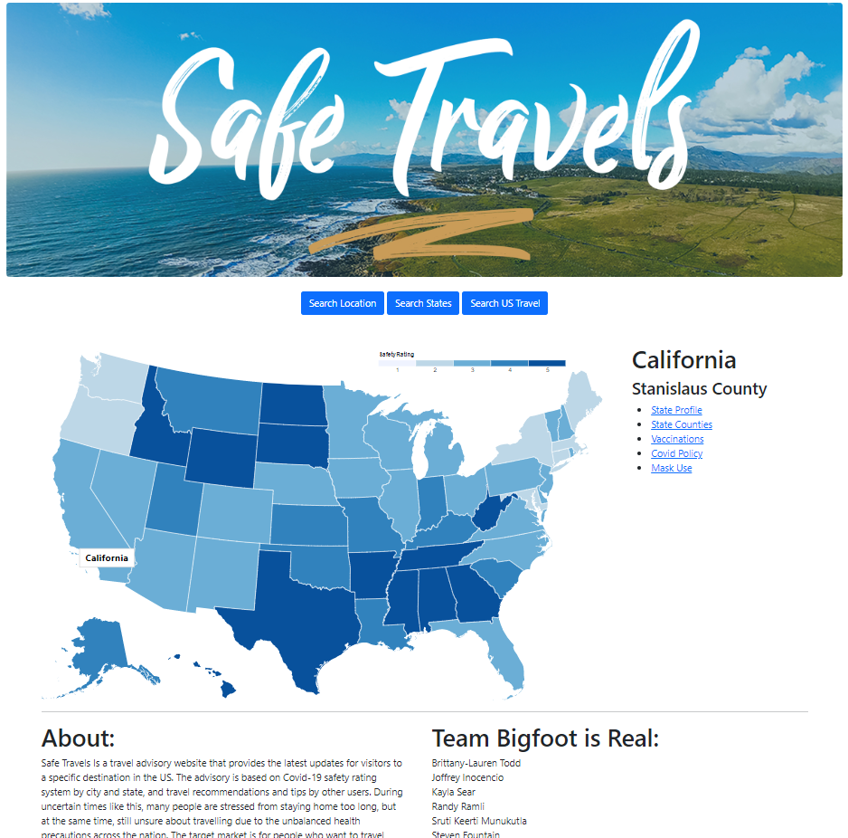
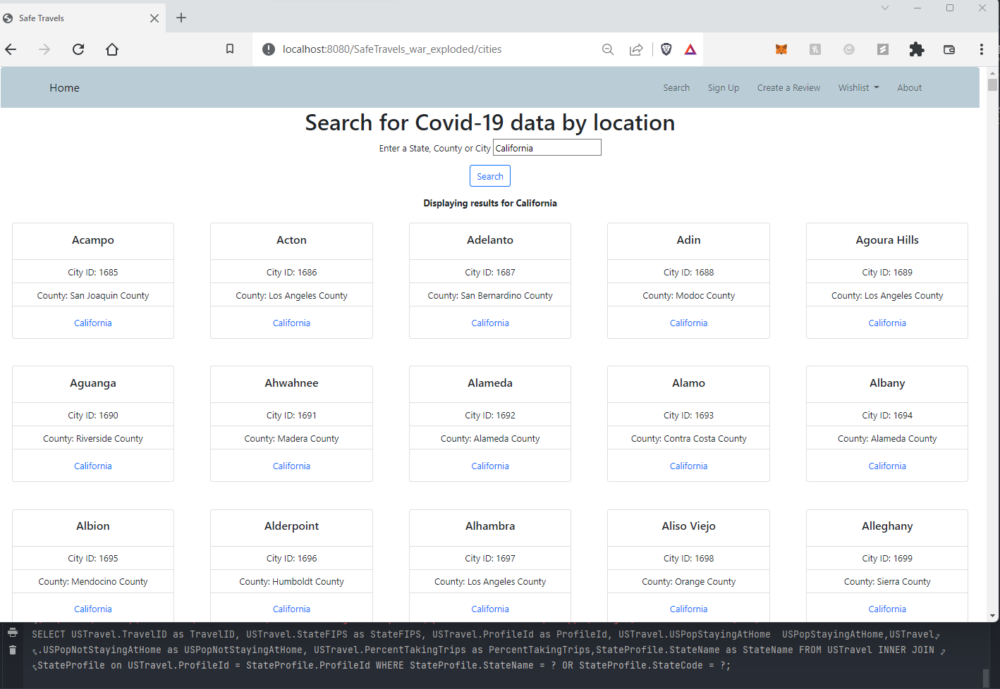
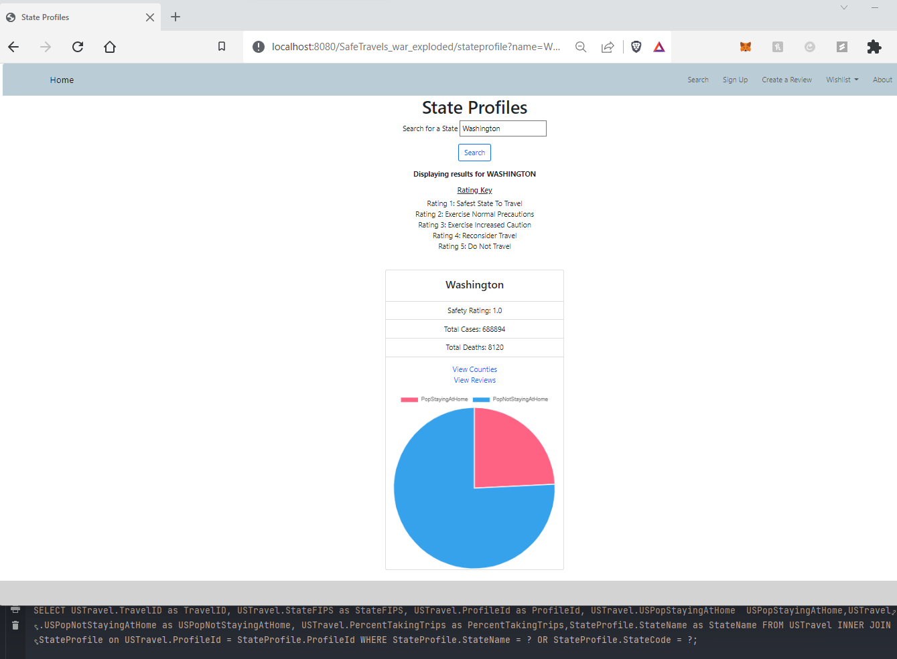

# SafeTravels Application

[SafeTravels Presentation - PDF](./Media/SafeTravelsPresentation.pdf)

 Home Page 

  

 Search Location Page 

  

 State Profile Page 

  

### Group Repository

Team Members: 
Brittany-Lauren Todd  
Joffrey Inocencio 
Kayla Sear 
Randy Ramli 
Sruti Keerti Munukutla 
Steven Fountain

## Table of contents

- [General info](#general-info)
- [Usage](#usage)
- [Features](#features)
- [Data Sources](#data-sources)
- [Status](#status)
- [Credits](#credits)
- [License](#license)

## General Info

> Welcome to our Repository!
> This repository is built with Java as a website project for our Safe Travels Web Application.
> The application uses MySQL, JDBC, and JSP for its
> data access layer and front-end framework.

## Usage

> Safe Travels is a travel advisory website that provides the latest updates for visitors to a specific destination in the US.
> The advisory is based on Covid-19 safety rating system by city, county, and state, and travel recommendations and tips by other users. During uncertain times like this, many people are stressed from staying home too long, but at the same time, still unsure about travelling due to the unbalanced health precautions across the nation. The target market is for people who want to travel, but are not happy with the false information spreading across the media. We want to provide our users with a one-stop place for reliable information on which location in the US is best for travelling, based on vaccination rate, mask mandate, and other Covid related policies.

## Features

**List of features:**

- User Profile
  - Create and delete an account
  - Update email and password
- State Profile\*
  - Safety Rating\*
- County Profile\*
- City Profile
- Safety Rating
- US Travel Statistics
  - By state
- Mask-Use
  - By county
- Policy Information
  - By county
- Vaccination rates\*
  - By county

**Advanced Features:**

- Search by “location”
- User wishlist
- User-generated reviews

*Snapshot data from October 12, 2021. 
*Safety rating is based on three criteria: rates of COVID-19 cases, COVID-19 related deaths and vaccination rates.
Each variable is divided by the total population of each state to get the rates.
We used the following formula to get a weighted average rate: 

`weightedAverageRate = (covidCasesRates + covidDeathRates + (1-vaccinationRates))/3`

Once we have the weighted rate for a state, we used another reference to help us determine which range
the rate falls in using a rating level from 1-5,
with 1 being the safest state and 5 with the unsafest state to travel.

## Data Sources

- Covid-19 State and County Policy Orders
  https://catalog.data.gov/dataset/covid-19-state-and-county-policy-orders-9408a
- United States Covid 19 Cases and Deaths By State
  https://catalog.data.gov/dataset/united-states-covid-19-cases-and-deaths-by-state-over-time
- Various datasets, masking
  https://github.com/nytimes/covid-19-data
- Transportation Statistics:
  https://www.bts.gov/daily-travel

## Project Status

**Finished**

## Credits

**Curriculum from :**  
CS5200 Database Management Systems
  Professor Bruce Chhay
  
[Northeastern University Khoury College of Computer Science](https://www.khoury.northeastern.edu/)

## License

**License :** Team Bigfoot Is Real 
**Copyright &copy; :** 2021 Brittany-Lauren Todd,
Joffrey Inocencio,
Kayla Sear,
Randy Ramli,
Sruti Keerti Munukutla,
Steven Fountain

